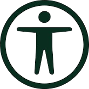
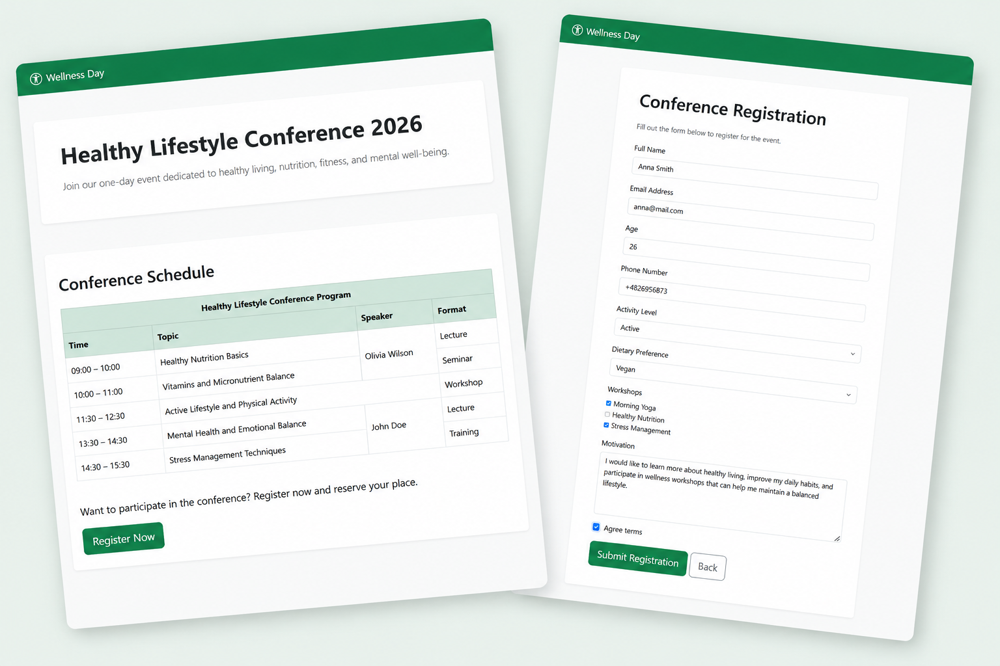
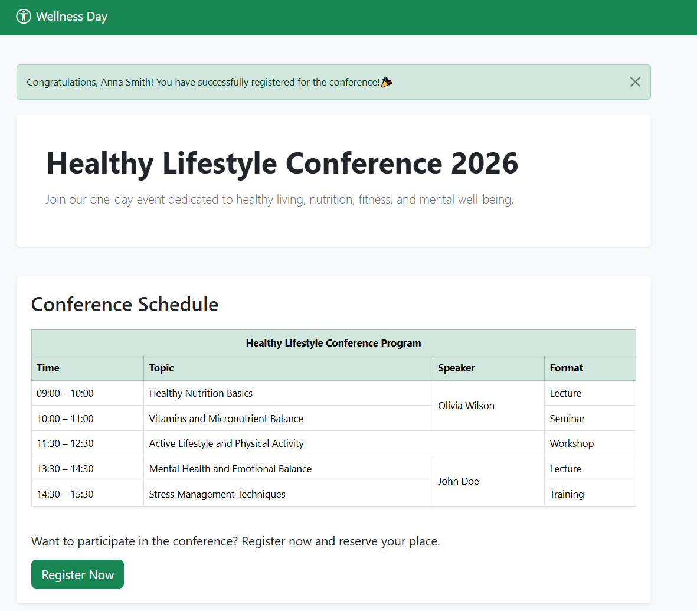
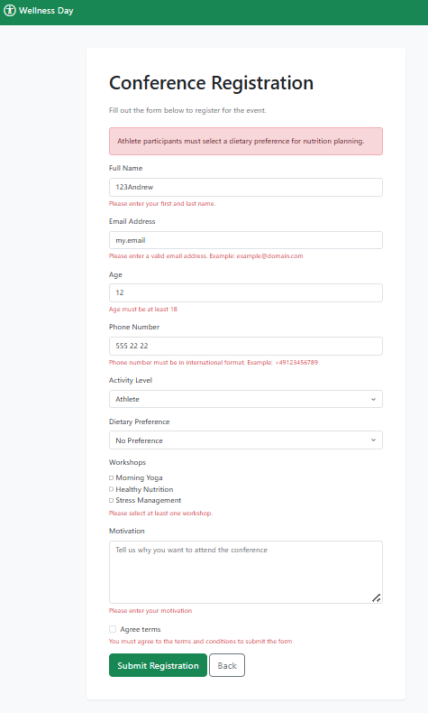

<h1>
  
  <span style="color: #092E20;">Wellness Day</span>
</h1>

A Django web application for a one-day **Healthy Lifestyle Conference**.
The project demonstrates advanced **form validation**, **custom validation logic**, and Django **messages framework** integration.

---


---

## 📌 Project Overview

**Wellness Day** is a simple conference website where users can:

* View conference information and schedule
* Register for the event via a structured form
* Receive validation feedback in real time
* See success messages after registration

The main goal of the project is to demonstrate:

* Django Forms usage
* Field-level and custom validation
* Clean UI with Bootstrap
* Messages framework
* Template structure with inheritance

---

## 🚀 Features

### 🧾 Registration System

* Full validation of all form fields
* Custom validation rules (business logic)
* Multiple choice selection (workshops)
* Checkbox agreement requirement

### 🔒 Validation Highlights

* Full name validation (letters only, first + last name required)
* Email format validation
* Age restrictions (18–100)
* Phone number regex validation (international format)
* Motivation minimum length + whitespace check
* Cross-field validation (clean method):

  * Age vs activity level rules
  * Dietary restrictions for athlete level
  * Maximum 2 workshops selection

### 💬 Messages Framework

* Success message after registration
* Error messages displayed in UI

### 🎨 UI

* Bootstrap 5 styling
* Responsive layout
* Clean form design
* Card-based UI

---

## 📁 Project Structure

```text
Wellness-Day/
│
├── src/
│   │
│   ├── app_wellness_day/              # Main application
│   │   ├── migrations/                # Database migrations
│   │   ├── __init__.py
│   │   ├── forms.py                   # Registration form and validation logic
│   │   ├── urls.py                    # Application URL routes
│   │   └── views.py                   # View functions
│   │
│   ├── config/                        # Project configuration
│   │   ├── __init__.py
│   │   ├── settings.py                # Project settings
│   │   └─── urls.py                   # Main URL configuration
│   │
│   ├── static/
│   │   └── images/
│   │
│   ├── templates/
│   │   ├── base.html                  # Base template with layout and messages
│   │   ├── home.html                  # Conference home page
│   │   └── register.html              # Registration form page
│   │
│   ├── db.sqlite3                     # SQLite database
│   └── manage.py                      # Django management script
│
├── .gitignore                         # Git ignored files
├── README.md                          # Project documentation
└── requirements.txt                   # Python dependencies
```

---

## ⚙️ Installation & Setup

### 1. Clone the repository

```bash
git clone git@github.com:Olli4ka/Wellness-Day.git
cd wellness-day
```

### 2. Create virtual environment

```bash
python -m venv venv
```

### 3. Activate virtual environment

#### Windows

```bash
venv\Scripts\activate
```

#### macOS / Linux

```bash
source venv/bin/activate
```

### 4. Install dependencies

```bash
pip install -r requirements.txt
```

### 5. Run migrations

```bash
python manage.py migrate
```

### 6. Start development server

```bash
python manage.py runserver
```

### 7. Open in browser

```text
http://127.0.0.1:8000/
```

---

## 🔁 How it works



1. User opens the home page
2. Clicks **Register Now**
3. Fills out the form
4. Django validates:

   * field validation
   * custom rules
   * cross-field logic
5. If valid:



   * success message is shown
   * user is redirected to home page
6. If invalid:



   * errors are shown next to fields

---

## 🧠 Key Learning Points

This project demonstrates:

* Django Form API usage
* Custom validation (`clean_field`, `clean`)
* Regex validation
* Error handling in templates
* Messages framework
* Template inheritance
* Clean separation of logic and UI

---

## 📌 Future Improvements

* Save registrations to database
* Add admin dashboard for participants
* Export registrations to CSV
* Add email confirmation after registration
* Add authentication system

---

## 👩‍💻 Author

Created as a learning project for Django practice focused on:
**validation, forms, and backend logic.**

